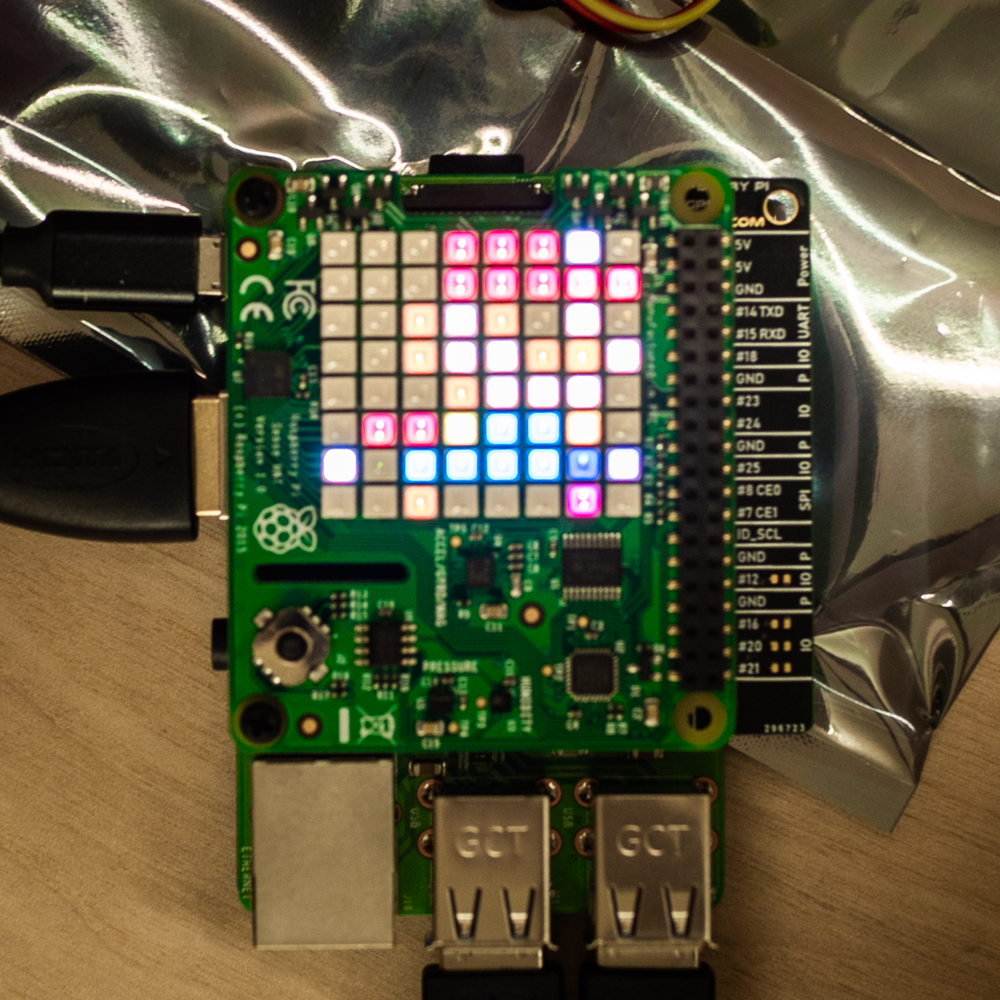
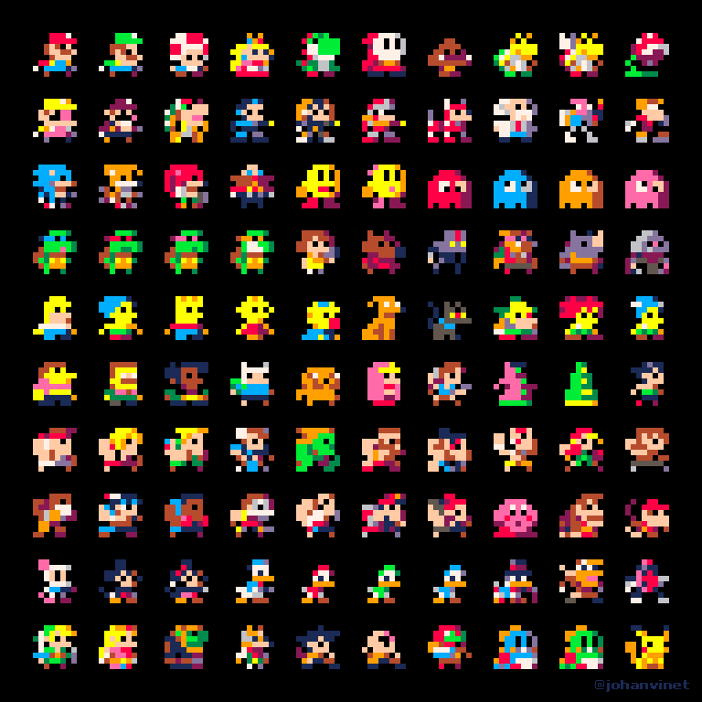

# Pixel-Art
Display famous characters in a pixel art reimagining on the Raspberry Pi SenseHAT shield.

   

## Getting started
**Make sure you are running Python 3 or above**

Open `pixel_art.py` in a Python IDE, such as Thonny. Test SenseHAT LEDs by running `pixel_art.py`. If Mario appears on the SenseHAT, you are ready to go.

## Changing Characters
To display another character on the SenseHAT, navigate to line 12 on `pixel_art.py`. Change `"mario.png"` to another filename*.

  **The list of compatible filenames are located in the `images` folder*

Here are all of the compatible characters you can display on the SenseHAT.

